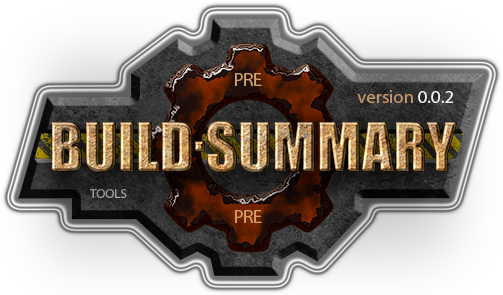

[](../README.md)  

[M]: #main       "головной файл документации"
[H]: ../README.md    "на главную"
[P]: icons/progress.png  "в процессе..."
[S]: icons/success.png   "ошибок не обнаружено"
    
<a name="main"></a>
[![S]][H] Документация v0.0.1
=============================
Главная задача инструмента - вывод краткой информации о сборке:  
  - краткое описание конфигурации сборки.  
  - используемый стандарт языка с++,  
  - используемая платформа, 
  - используемая IDE

Инструмент выводит в консоль сборки информацию вида:  
```
1>------------------------------------[sample]
1>__cplusplus ....... 201703L
1>c++17 ............. enabled
1>msvc2019 .......... 16.11.19
1>_MSC_FULL_VER ..... 192930146
1>_MSVC_LANG ........ 201703L
1>_MSC_EXTENSIONS ... enabled
1>  ---
1>[sample] disabled -> pch
1>[sample] STABLE-DEBUG
1>[sample] MTd (debug-static runtime c++)
1>[sample] 0.0.5, x86-debug-MTd, stable
1>  ---
```
<br/>

Кроме того, инструмент предоставляет макро-функции,  
с помощью которых можно выводить произвольный текст в лог сборки.  

Публичное API:  
  - `dCOMPILER_MESSAGE(...)` не отключаемый  
  - `dPRAGMA_MESSAGE(...)`   отключаемый  
  - `dSHOW_BUILD(title, name)` информация о сборке  

--------------------------------------------------------------------------------

Пример вывода в лог сборки значения `__cplusplus `  

```cpp
    // -- не отключаемый макрос
    dCOMPILER_MESSAGE("с++ version: " dSSTRINGIZE(__cplusplus))

    // -- опции для подавления вывода текста
    // #define dHIDE_MSVC_MESSAGES 1
    // #define dHIDE_CLANG_MESSAGES 1
    // #define dHIDE_MINGW_MESSAGES 1
    // #define dHIDE_GCC_MESSAGES 1

    // -- вывод текста можно отключить
    dPRAGMA_MESSAGE("с++ version: " dSSTRINGIZE(__cplusplus))
```

--------------------------------------------------------------------------------

Пример использования макро-функции `dSHOW_BUILD`  

```cpp
#include <sample/sample.ver>
#include <build_summary/info.hpp>
dSHOW_BUILD("[sample]", dSAMPLE)
```

Где, содержимое версионного файла имеет вид:  

```cpp
// содержимое sample.ver
#pragma once
#define dSAMPLE_MAJOR 0
#define dSAMPLE_MINOR 0
#define dSAMPLE_PATCH 1
```

Таким образом, `dSAMPLE` - это префикс,  
с помощью которого определяются тройки чисел версии.  
<br/>

--------------------------------------------------------------------------------

[Хронология](chrono.md)  
[История](history.md)  

